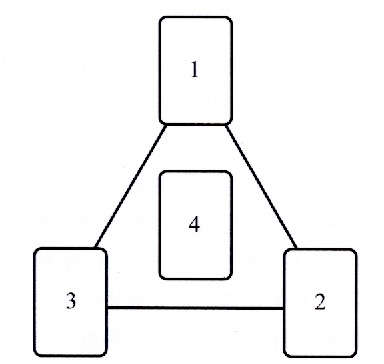
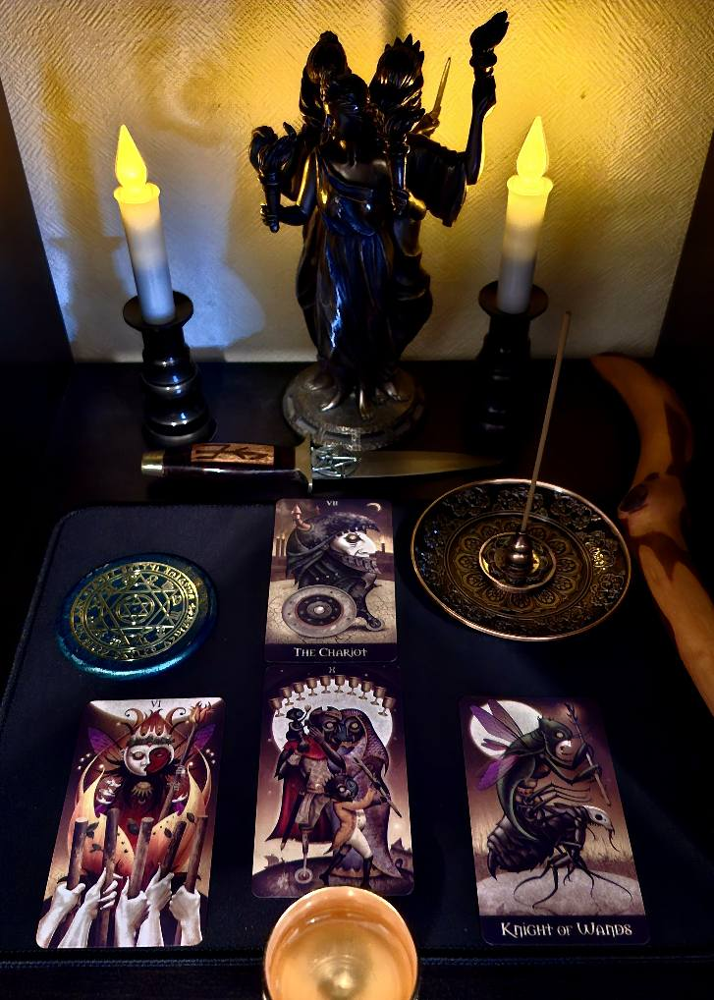
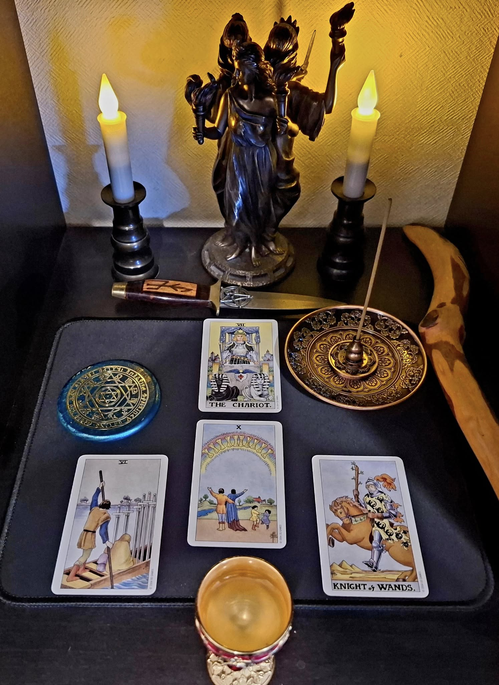

# 旅の安全を祈る儀式

## 🧭 概要

この儀式は、旅の出発に際して安全と導きを祈るためのものです。Deviant Moon Tarot や Universal Tarot などの小型タロットを用い、本棚神殿にてヘカテ女神に「旅路の加護」と「無事の帰還」を祈願します。

※使用するタロットデッキは自由です。ここで紹介するカード構成は一例としてご活用ください。

## 📆 適したタイミング

- 出発の一ヶ月以内（準備期間を含めて）
- 新月から上弦の月の期間
- 長距離の移動、霊的な巡礼、転居などの前

## 🔮 用意するもの

- 本棚神殿
- 小型のタロットデッキ（任意のもの）
- 電池式キャンドル、香炉など（任意）

## 🃏 使用カードと意味（シセロ方式・一例）

| 番号 | 役割       | カード                       | 意味                             |
|------|------------|------------------------------|----------------------------------|
| 1    | 対象       | The Chariot（戦車）          | 旅そのもの、移動、意思ある前進 |
| 2    | 初動       | Knight of Wands（ワンドのナイト） | 勇気ある出発                     |
| 3    | 進行       | Six of Swords（ソードの6）     | 安全で穏やかな移動               |
| 4    | 結果       | Ten of Cups（カップの10）      | 無事な帰還と心の満足             |

## ✨ 儀式の流れ

1. 本棚神殿にカード4枚を、下記のカード配置レイアウトを参考に配置する。
2. キャンドルを灯し、心を静める。
3. 以下の祈祷文を声に出して読む（英語＋日本語）。
4. 必要に応じてしばらくカードをそのままに保ち、旅の間守護を祈る。

## 🗺️ カード配置レイアウト

この儀式で使用するカードの配置は以下の通りです：

## 🕯️ 祈りの言葉 — Invocation to Hekate for a Safe Journey

> O Hekate, Torchbearer of the crossroads,  
> She who guides through shadowed lands,  
> I call upon you to bless this journey.  
> Light the path before me,  
> Steady the wheels beneath me,  
> Shield me from the perils unseen.  
> （三叉路の光を持つヘカテよ、  
> 影の地を導く女神よ、  
> この旅を祝福してください。  
> 我が前方を照らし、  
> 我が足元を確かにし、  
> 見えざる危険から守ってください。）

> Let the Chariot roll swift and true,  
> Let the Wand blaze with courage,  
> Let the Swords part the waters,  
> Let the Cups overflow with joy.  
> （戦車は真っ直ぐに、速やかに進み、  
> ワンドは勇気をもって輝き、  
> ソードは障害を切り開き、  
> カップは喜びで満たされるように。）

> May I return home under your watchful eyes,  
> Enriched, enlightened, and unharmed.  
> So mote it be.  
> （あなたの見守りのもと、  
> 私が無事に、豊かに、そして新たな光とともに帰還できますように。  
> そのようにあれ。）

## 🖼️ 写真による実例

### 使用例：Deviant Moon Tarot  

### 参考例：Universal Tarot  

## 📚 参考文献

このプロトコルは、チック・シセロとサンドラ・タバサ・シセロによる『タロット・タリスマン』をベースに再構成されています。
Ravensgateプロジェクトの一環として、本棚神殿と現代的ツールによる日常的な魔術の実践例として設計されています。

## 🔓 ライセンス

© 2025 知られざる呪術師（Le Sorcier Inconnu）  
本ドキュメントは [Creative Commons BY-SA 4.0](https://creativecommons.org/licenses/by-sa/4.0/deed.ja) に基づき公開されています。
